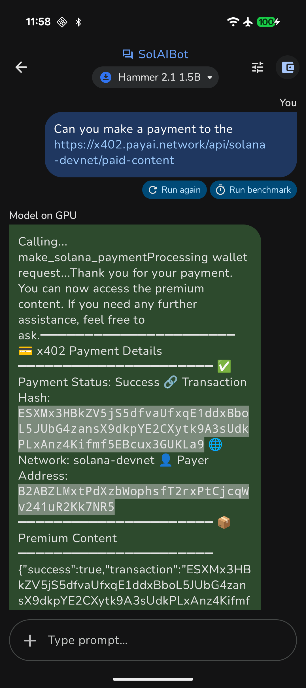

<div align="center">

# Easy Solana Payments
## On-device AI Agents + x402 Payment Protocol

[](LICENSE)

**A Cypherpunk & Hackaroo 2025 Submission**

 

</div>

---

## 🎯 Project Vision

This hackathon submission demonstrates the future of AI-powered micropayments through two complementary implementations:

1. **SolAIBot** - An Android app with on-device AI that makes autonomous payments
2. **Solana Agent Kit** - A TypeScript toolkit enabling any AI agent to transact on Solana

Together, they showcase how AI agents can autonomously discover, pay for, and consume protected content using the x402 payment protocol and Solana blockchain—all while maintaining user privacy and control.

---

## 📱 Part 1: SolAIBot - On-Device AI with x402 Payments

### Overview

SolAIBot is an Android application that runs Large Language Models (LLMs) entirely on-device, enabling privacy-first AI interactions that can autonomously make Solana payments for protected content.

### Key Features

- **📱 Fully Offline AI:** Experience GenAI without internet connectivity—all LLM processing happens on your device using Google AI Edge (LiteRT)
- **🤖 Default Model:** Hammer 2.1 (1.5B) loads automatically and supports function calling for payments
- **💬 Multi-turn Conversations:** Engage in natural chat with AI that remembers context
- **📊 Performance Insights:** Real-time benchmarks (TTFT, decode speed, latency)
- **🧩 Model Compatibility:** Test your own LiteRT `.litertlm` models
- **🔐 Solana Wallet Integration:** Connect via Solflare or any Mobile Wallet Adapter (MWA) compatible wallet
- **💳 x402 Payments:** AI autonomously makes payments for protected APIs and services

### How It Works

When the LLM needs to access paid content:

1. LLM generates: `FUNCTION_CALL: solana_payment(url="https://example.com/paid-content")`
2. Client requests the URL without payment
3. Server responds with `402 Payment Required` + payment details
4. Client builds Solana transaction with required amount
5. User approves transaction via Mobile Wallet Adapter
6. Client retries request with `X-PAYMENT` header containing transaction signature
7. Facilitator verifies and settles payment on blockchain
8. Server returns content + settlement confirmation
9. LLM presents the paid content to the user

### Technical Stack

- **Language:** Kotlin (100% Kotlin codebase)
- **UI:** Jetpack Compose with Material 3
- **Architecture:** MVVM with Hilt dependency injection
- **AI Framework:** Google AI Edge with LiteRT for on-device inference
- **Blockchain:** Solana via Mobile Wallet Adapter (MWA), sol4k, and Web3 SDK
- **Min SDK:** Android 12 (API 31)
- **Version:** 1.0.7 (versionCode: 13)

### Get Started

1. **Download:** Install the APK from [latest release](https://github.com/quantaliz/solaibot/releases/latest/)
2. **Requirements:** Android 12 or higher
3. **Setup Wallet:** Install Solflare or any MWA-compatible wallet
4. **Start Chatting:** Ask the AI to fetch paid content and approve payments when prompted

[Full Documentation →](android/README.md) | [Developer Guide →](android/AGENTS.md)

---

## 🤖 Part 2: Solana Agent Kit - AI Agent Toolkit with x402 Plugin

### Overview

A fork of the [sendaifun/solana-agent-kit](https://github.com/sendaifun/solana-agent-kit) repository, enhanced with production-ready x402 payment capabilities for the Cypherpunk hackathon. This TypeScript toolkit enables any AI agent—using any model—to autonomously perform 60+ Solana operations, including autonomous payments.

### Cypherpunk Contributions

#### x402 Payments Plugin (`@solana-agent-kit/plugin-payments`)

A production-ready payment pipeline that enables AI agents to autonomously handle HTTP 402 payment challenges:

- **Core Methods:**
  - `makeX402PaymentRequest` - Automatically handles 402 challenges, builds transactions, and retries with payment headers
  - `getX402PaymentInfo` - Retrieves payment requirements without executing the payment

- **Smart Features:**
  - Signer caching for performance
  - Automatic Solana network inference (mainnet/devnet/testnet)
  - First-class AI tool integration via `x402_payment_request` action

- **Framework Support:**
  - Vercel AI SDK flows
  - LangChain integration
  - OpenAI agents
  - Model Context Protocol (MCP) deployments

#### Comprehensive Testing

Built-in test suite (`test/plugin-payment-tests/payments.ts`) that simulates:
- RPC primitives
- 402 challenge/response flows
- Payment receipt verification
- End-to-end payment workflows

#### Example Implementations

**1. x402 Payments CLI (`examples/x402-payments`)**
- Scriptable demonstration of payment flows
- Environment scaffolding with `.env` setup
- Narrative logging for each payment step
- Live demos of `makeX402PaymentRequest` and AI tool wiring

**2. x402 Payments MCP Server (`examples/x402-payments-mcp`)**
- Claude-ready MCP server for desktop AI integration
- Configuration via `claude_desktop_config.json`
- Turnkey deployment with build and dev scripts
- Test prompts for live payment demonstrations

#### Developer Experience Improvements

- Updated build targets and TypeScript configurations
- Enhanced dependency management
- Improved CI/CD posture
- Comprehensive documentation in `docs/x402.md`
- Clean compilation across ESM/CJS targets

### Quick Start

```bash
# Clone and install
git clone https://github.com/quantaliz/solana-agent-kit
cd solana-agent-kit
pnpm install
pnpm build

# Build payment examples
pnpm build:examples:payments
pnpm build:examples:payments-mcp

# Run MCP server
pnpm run:examples:payments-mcp
```

### Usage Example

```typescript
import { SolanaAgentKit, createVercelAITools, KeypairWallet } from "solana-agent-kit";
import PaymentsPlugin from "@solana-agent-kit/plugin-payments";

const keyPair = Keypair.fromSecretKey(bs58.decode("YOUR_SECRET_KEY"));
const wallet = new KeypairWallet(keyPair);

const agent = new SolanaAgentKit(
  wallet,
  "YOUR_RPC_URL",
  { OPENAI_API_KEY: "YOUR_OPENAI_API_KEY" }
).use(PaymentsPlugin);

// AI agent automatically handles payments when encountering 402 responses
const result = await agent.methods.makeX402PaymentRequest(
  agent,
  "https://api.example.com",
  "/protected-endpoint"
);
```

[Full Documentation →](solana-agent-kit/README.md) | [Developer Guide →](solana-agent-kit/AGENTS.md)

---

## 🏆 Hackathon Submission

This project is submitted to:
- **[Cypherpunk 2025](https://www.colosseum.com/cypherpunk)** - Solana hackathon focused on privacy and cryptography
- **[Hackaroo 2025](https://www.hackaroo.xyz)** - Innovation hackathon for blockchain applications

### Key Innovation

**Combining on-device AI with autonomous blockchain payments to create privacy-preserving AI agents that can access paid resources without compromising user control.**

### Why This Matters

1. **Privacy First:** On-device AI means your conversations never leave your device
2. **User Control:** All payments require explicit user approval via trusted wallet apps
3. **Autonomous Operation:** AI agents can discover and pay for content without manual intervention
4. **Cross-Platform:** Same payment protocol works on mobile (Android) and desktop (MCP/Claude)
5. **Developer Friendly:** Easy-to-use SDKs for both mobile and server-side AI applications

---

## 🛠️ Technology Highlights

### Mobile (SolAIBot)
- Google AI Edge & LiteRT for on-device inference
- Kotlin with Jetpack Compose
- Mobile Wallet Adapter (MWA) for secure transaction signing
- Solana Web3 SDK & sol4k for blockchain integration
- x402 HTTP Payment Protocol implementation

### Agent Kit (TypeScript)
- Plugin-based architecture for modularity
- Support for 60+ Solana operations
- Integration with LangChain, Vercel AI SDK, OpenAI
- Model Context Protocol (MCP) support for Claude
- Production-ready x402 payment pipeline

---

## 📄 License

Licensed under the Apache License, Version 2.0. See the [LICENSE](LICENSE) file for details.

---

## 👤 Developer

<div align="center">


**Developed by [Quantaliz](https://www.quantaliz.com)**

🚀 **Where AI Meets Web3 — All on Your Device**

Built with ❤️ for **Cypherpunk** & **Hackaroo 2025**

</div>

