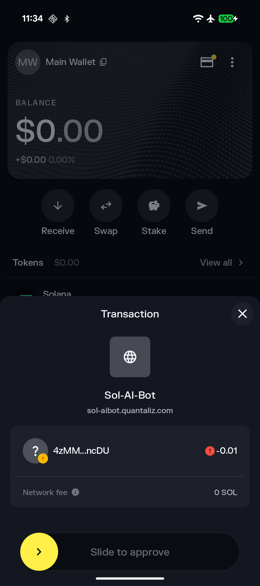

<div align="center">

# Financially Autonomous AI Agents with x402 Payments
## Privacy-First AI Meets Solana Micropayments

[](LICENSE)

**Hackathon Submission:** [Cypherpunk 2025](https://www.colosseum.com/cypherpunk) & [Hackaroo 2025](https://www.hackaroo.xyz)

 

</div>

---

## 🎯 The Innovation

We've built a **toolset** for AI agents to autonomously access paid content and services using Solana blockchain payments—from mobile devices to cloud servers, from chatbots to desktop assistants.

### The Problem

Traditional AI assistants face three critical limitations:
1. **Cloud Dependency:** Require constant internet connectivity and expose user data to third parties
2. **Payment Barriers:** Can't autonomously access paid APIs without breaking agent autonomy
3. **User Control:** Either too restrictive (no autonomy) or too permissive (security risks)

### Our Solution

Two complementary implementations that work together to enable truly autonomous, privacy-preserving AI agents:

1. **🤖 SolAIBot** - Android app with on-device AI and Mobile Wallet Adapter payments
2. **⚡ x402 Payments Plugin** - Node.js toolkit extending Solana Agent Kit with autonomous payments

Together, they demonstrate that AI agents can be **completely private AND financially autonomous**—no compromises.

---

## 🏆 Hackathon Submission

### Dual Submission Strategy

**[Cypherpunk 2025](https://www.colosseum.com/cypherpunk)** - Privacy & Cryptography Focus
- ✅ **Complete on-device AI processing** - Zero LLM server communication (SolAIBot)
- ✅ **Self-sovereign agent wallets** - Cryptographic security without central authority (Both)
- ✅ **Privacy-preserving payment protocol** - x402 implementation on Solana (Both)
- ✅ **Zero-knowledge payments** - MWA ensures app never sees private keys (SolAIBot)
- ✅ **Cypherpunk ethos:** "Privacy is necessary for an open society in the electronic age"

**[Hackaroo 2025](https://www.hackaroo.xyz)** - Solana Micropayments
- ✅ **Novel x402 integration** - First Android + Node.js implementation for AI (Both)
- ✅ **AI agent autonomy** - Full blockchain interaction capabilities (Both)
- ✅ **Solana ecosystem advancement** - MWA, RPC, transaction building, payment flows (Both)
- ✅ **Real-world utility** - Working demos with live payment endpoints (Both)
- ✅ **Cross-platform architecture** - Mobile to desktop payment ecosystem (Both)

### What Makes This Special

1. **Complete Ecosystem:** Not just a proof-of-concept—full mobile app + server toolkit with working demos
2. **Production Ready:** Comprehensive testing, error handling, live endpoints, and APK release
3. **Technical Depth:** Full-stack integration from on-device inference to on-chain settlement
4. **Open Innovation:** Built on permissive licensing with extensible architecture
5. **Real Use Case:** Solves the AI micropayment problem without compromising privacy

---

## 📱 Part 1: SolAIBot - On-Device AI with x402 Payments

<div align="center">

### Privacy-First AI Agent with Autonomous Blockchain Payments

[**📱 Download APK**](https://github.com/quantaliz/solaibot/releases/latest/) | [**📖 Full Documentation**](android/README.md) | [**🛠️ Developer Guide**](android/AGENTS.md)

</div>

### Overview

SolAIBot is an Android (Seeker Compatible) application that runs a 1.5B parameter LLM entirely on-device, enabling **completely private** AI interactions with the capability to autonomously make Solana payments for protected content via Mobile Wallet Adapter (MWA).

### ✨ Key Features

**🧠 On-Device AI Processing**
- **100% Offline Inference:** All LLM processing happens locally using Google AI Edge (LiteRT)
- **Hammer 2.1 LLM (1.5B):** Optimized for mobile with function calling capabilities
- **Multi-turn Conversations:** Stateful chat with context preservation
- **Real-time Performance Metrics:** TTFT, decode speed, and latency monitoring
- **Model Flexibility:** Support for custom `.litertlm` models
- **GPU Acceleration:** TensorFlow Lite GPU optimization

**🔐 Blockchain Integration (Fully Implemented)**
- **x402 Payment Protocol:** First Android implementation of HTTP 402 for AI
- **Mobile Wallet Adapter (MWA):** Secure transaction signing via Solflare and compatible wallets
- **Function Calling:** LLM autonomously triggers `solana_payment()` for paid resources
- **Zero Trust Architecture:** App never accesses private keys; all signing via MWA
- **Facilitator Settlement:** Third-party on-chain settlement with merchant-paid fees
- **Transaction Builder:** Precise account ordering for Solana program compatibility

**🎨 User Experience**
- **Modern Jetpack Compose UI:** Reactive, declarative interface built with Material3
- **MVVM Architecture:** Clean separation with Hilt dependency injection
- **Background Downloads:** WorkManager-powered model downloads
- **Payment Feedback:** Explicit success/failure messaging for blockchain transactions

More details in its [README](android/README.md)

---

## ⚡ Part 2: x402 Payments Plugin for Solana Agent Kit

<div align="center">

### Node.js Toolkit for AI Agent Payments

[**💻 View Repository**](solana-agent-kit/) | [**📖 Full Documentation**](solana-agent-kit/README.md) | [**🛠️ Developer Guide**](solana-agent-kit/AGENTS.md)

</div>

### Overview

We've extended the powerful [Solana Agent Kit](https://github.com/sendaifun/solana-agent-kit) with **groundbreaking x402 payment capabilities** that enable AI agents to autonomously pay for protected API access using the Solana blockchain. This isn't just a proof-of-concept—it's a production-ready system with comprehensive testing, documentation, and real-world examples.

### ✨ Core Contributions

**🤖 Production-Ready Payment Plugin (`@solana-agent-kit/plugin-payments`)**
- **Fully Autonomous Payment Flow:** AI agents automatically detect HTTP 402 paywalls, execute Solana transactions, and retry with payment headers—zero human intervention
- **Smart Signer Caching:** Optimized transaction signing with intelligent caching for high-performance operations
- **Network Auto-Detection:** Seamlessly switches between mainnet and devnet based on RPC configuration
- **Framework Integration:** First-class `x402_payment_request` action integrates with Vercel AI SDK, LangChain, and OpenAI frameworks
- **Zero Glue Code:** Direct integration with AI frameworks via clean plugin architecture

**🧪 Comprehensive Testing Infrastructure**
- **End-to-End Test Suite:** Complete test coverage in `test/plugin-payment-tests/` with mocked RPC primitives
- **Regression-Proof:** Validates complete payment handshake from challenge to settlement confirmation
- **Real-World Scenarios:** Network detection, signer caching, error handling, and retry logic
- **Production-Grade:** Tests mirror actual Solana devnet/mainnet behavior

**💻 Battle-Tested Examples**

**CLI Payment Demo** (`examples/x402-payments`)
- Scriptable demonstration with step-by-step narrative logging
- Shows agents autonomously paying for protected content
- Complete environment setup and wallet configuration guide

**MCP Server** (`examples/x402-payments-mcp`)
- Full Model Context Protocol server for Claude Desktop integration
- Exposes entire payment surface to desktop AI assistants
- Turnkey deployment with minimal configuration

**🏗️ Enterprise-Grade Infrastructure**
- **Memory Optimization:** Solved OOM issues in constrained environments
- **Dual Module Support:** Clean ESM/CJS builds for maximum compatibility
- **Monorepo Integration:** Seamless turbo + pnpm pipeline integration
- **Comprehensive Documentation:** Complete payment flow guide in `docs/x402.md`

More details in its [README](solana-agent-kit/README.md)

---

## 🌐 Complete Ecosystem Architecture

```
┌─────────────────────────────────────────────────────────────┐
│                    AI Agents Ecosystem                       │
├─────────────────────────────────────────────────────────────┤
│                                                               │
│  📱 MOBILE                          💻 DESKTOP/SERVER        │
│  ┌─────────────────┐                ┌─────────────────┐     │
│  │   SolAIBot      │                │  Solana Agent   │     │
│  │                 │                │      Kit        │     │
│  │ • On-device LLM │                │ • Node.js       │     │
│  │ • Kotlin        │                │ • TypeScript    │     │
│  │ • MWA payments  │                │ • Any LLM       │     │
│  │ • Android 12+   │                │ • Multi-chain   │     │
│  └────────┬────────┘                └────────┬────────┘     │
│           │                                  │              │
│           └────────┬─────────────────────────┘              │
│                    │                                        │
│         ┌──────────▼──────────┐                            │
│         │  x402 Protocol      │                            │
│         │  HTTP 402 Payments  │                            │
│         └──────────┬──────────┘                            │
│                    │                                        │
│         ┌──────────▼──────────┐                            │
│         │  Solana Blockchain  │                            │
│         │  • 400ms finality   │                            │
│         │  • Low fees         │                            │
│         │  • MWA security     │                            │
│         └─────────────────────┘                            │
│                                                             │
└─────────────────────────────────────────────────────────────┘
```

---

## 🔍 Why This Matters

### For Users
- **Privacy Protected:** Your AI conversations never leave your device (SolAIBot)
- **Full Control:** Every payment requires your explicit approval
- **True Autonomy:** AI can access paid services without breaking your workflow
- **Cross-Platform:** Same payment protocol works everywhere

### For Developers
- **Easy Integration:** Drop-in plugins for both mobile and server environments
- **Production Ready:** Comprehensive testing and error handling
- **Well Documented:** Complete guides, examples, and API documentation
- **Open Source:** Apache 2.0 license, extensible architecture

### For the Ecosystem
- **Agent-to-Agent Commerce:** AI agents can purchase services from other agents
- **Instant Micropayments:** Solana's 400ms blocks make per-request payments viable
- **API Monetization:** Service providers can easily paywall endpoints with x402
- **Future-Proof:** Extensible design ready for multi-chain expansion

---

## 📦 Project Structure

```
/proj
├── android/                          # SolAIBot Android App
│   ├── app/src/main/java/com/quantaliz/solaibot/
│   │   ├── data/x402/               # x402 payment implementation
│   │   ├── ui/wallet/               # Wallet UI components
│   │   └── ...                      # Other app modules
│   ├── README.md                    # Full app documentation
│   └── AGENTS.md                    # Developer guidelines
│
├── solana-agent-kit/                # Extended Solana Agent Kit
│   ├── packages/plugin-payments/   # x402 payment plugin
│   ├── examples/
│   │   ├── x402-payments/          # CLI demo
│   │   └── x402-payments-mcp/      # MCP server demo
│   ├── test/plugin-payment-tests/  # Comprehensive tests
│   ├── docs/x402.md                # Payment flow guide
│   ├── README.md                   # Full toolkit documentation
│   └── AGENTS.md                   # Developer guidelines
│
├── images/                          # Screenshots and branding
│   ├── SolAIBot1-Result.png        # App interface
│   ├── SolAIBot2-Sign.png          # Payment signing
│   └── Quantaliz.png               # Company logo
│
└── README.md                        # This file
```

---

## 🚀 Future Roadmap

### Post-Hackathon Features

**SolAIBot Mobile:**
- [ ] Mainnet support for production payments
- [ ] SPL token payments beyond SOL
- [ ] Multi-model support for simultaneous LLMs
- [ ] Voice interface for hands-free operation
- [ ] Custom plugins for extensible tasks

**Solana Agent Kit:**
- [ ] Multi-chain support (extend x402 to EVM chains)
- [ ] Payment streaming for subscriptions
- [ ] Advanced caching for payment receipts
- [ ] Agent marketplace discovery platform
- [ ] Analytics dashboard for payment tracking

**Ecosystem Integration:**
- [ ] Desktop version of SolAIBot
- [ ] Mobile SDK for native agent integration
- [ ] MCP client support in SolAIBot
- [ ] Cross-chain payment bridges
- [ ] Agent-to-agent communication protocol

---

## 🎓 Technical Documentation

### SolAIBot (Android)
- **[android/README.md](android/README.md)** - Complete app documentation
- **[android/docs/](android/docs/)** - x402 protocol specs and guides

### Solana Agent Kit (Node.js)
- **[solana-agent-kit/README.md](solana-agent-kit/README.md)** - Full toolkit documentation
- **[solana-agent-kit/docs/x402.md](solana-agent-kit/docs/x402.md)** - Complete payment flow guide

### External Resources
- **[Cypherpunk 2025](https://www.colosseum.com/cypherpunk)** - Hackathon homepage
- **[Hackaroo 2025](https://www.hackaroo.xyz)** - Hackathon homepage
- **[Solana Docs](https://docs.solana.com)** - Solana developer documentation
- **[x402 Protocol](https://github.com/coinbase/x402)** - Coinbase x402 specification


---

## 👤 About Quantaliz

<div align="center">

</div>

**[Quantaliz PTY LTD](https://www.quantaliz.com)** is pioneering the intersection of privacy-preserving AI and decentralized technologies. We believe the future of AI is local, private, and economically integrated with Web3.

### Contact & Links
- **Website:** [quantaliz.com](https://www.quantaliz.com)
- **GitHub:** [github.com/quantaliz](https://github.com/quantaliz)

---

## 📄 License

Licensed under the **Apache License 2.0** - See [LICENSE](LICENSE) for details.

### Acknowledgments

- **SolAIBot:** Built upon [Google AI Edge Gallery](https://github.com/google-ai-edge/gallery) under permissive open-source licensing
- **Solana Agent Kit:** Extended from [sendaifun/solana-agent-kit](https://github.com/sendaifun/solana-agent-kit)

---

<div align="center">

## 🚀 Where Privacy-First AI Meets Solana Speed

**Built for Cypherpunk 2025 & Hackaroo 2025**

*Demonstrating that AI agents can respect privacy and become financially autonomous*

[](https://github.com/quantaliz/solaibot/releases/latest/)
[](https://github.com/quantaliz/solana-agent-kit)

[](https://www.colosseum.com/cypherpunk)
[](https://www.hackaroo.xyz)

⭐ Star the repos | 📱 Download the app | 💻 Try the examples | 💬 Join the discussion

</div>
